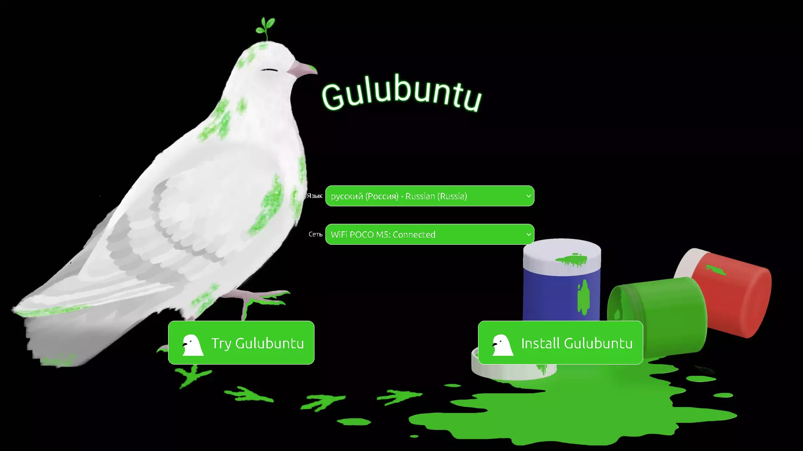
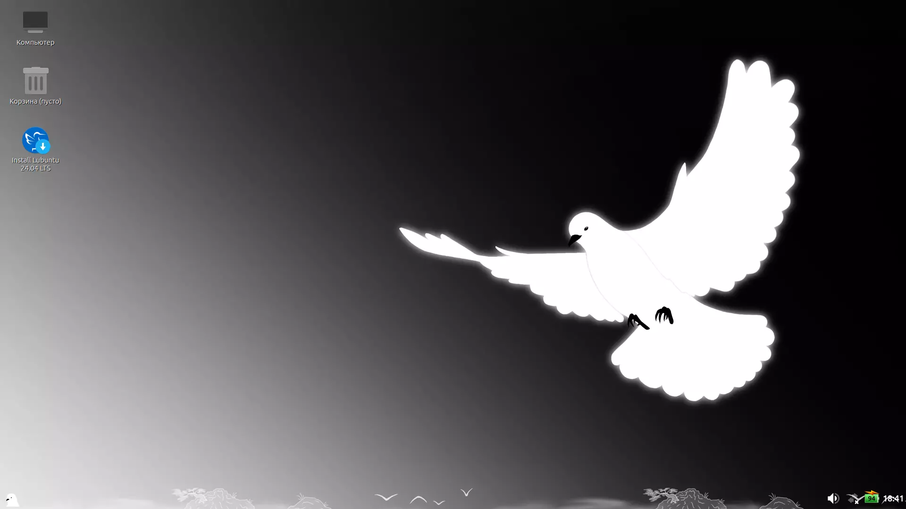
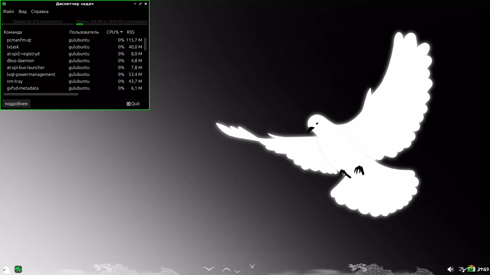

# Gulubuntu
Gulubuntu - это дистрибутив, который, будучи основан на Lubuntu, стремится к минимализму и простоте, сохраняя при этом удобство использования.

# Цели
1. Упрощение использования для новичков.
 - Создать интуитивно понятный графический интерфейс.
 - Минимизировать необходимость работы с командной строкой.
 - Реализовать графическую оболочку для множества системных настроек.

2. Оптимизация ресурсопотребления.
 - Минимизировать потребление оперативной памяти системой.
 - Снизить нагрузку на процессор в режиме простоя.
 - Оптимизировать дисковое пространство за счет удаления неиспользуемых компонентов.
 - Улучшить энергоэффективность для продления времени работы от батареи.

3. Расширение функциональности "из коробки"
 - Предустановить базовый набор пакетов с учетом ваших интересов.
 - Предоставить лёгкие и при этом необходимые настройки в одном месте.
 - Создать автоматические сценарии для повседневных задач.

# Начало

# Рабочий стол

# Потребление

# Меню

# Участие в проекте
Gulubuntu — это проект с открытым исходным кодом, и мы приветствуем участие каждого! Как говорилось в слогане Lubuntu: неважно, сколько вам лет — 13 или 82. Независимо от вашего возраста и уровня опыта, вы можете внести вклад в развитие дистрибутива.

# Как вы можете помочь?

 - Разработка — улучшение кода, исправление багов, добавление новых функций.

 - Тестирование — поиск ошибок, тестирование на различном оборудовании.

 - Документация — написание и улучшение документации, создание руководств.

 - Дизайн — работа над интерфейсом, иконками, темами оформления.

 - Переводы — локализация на другие языки.

 - Сообщество — помощь новым пользователям, модерация сообщества.

 - Обратная связь — предложения по улучшению, отчеты об ошибках.

Связаться со мной: [Здесь](https://psevdonimux.ru/)

Присоединяйтесь и помогите сделать Gulubuntu еще удобнее и проще!

# [Скачать](https://sourceforge.net/projects/gulubuntu/files/gulubuntu-24.04.1-2025.12.05-desktop-amd64.iso/download)
