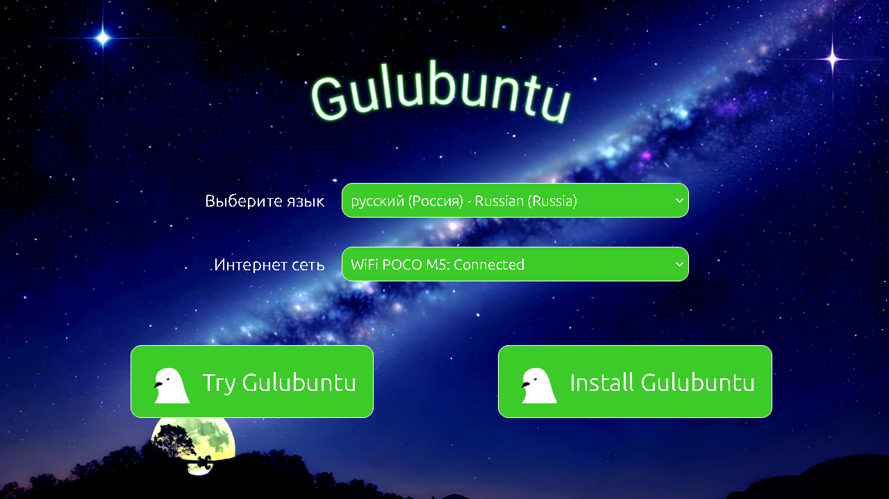

# Gulubuntu
Gulubuntu - это дистрибутив, который основан на Lubuntu

# Цели
1. 
# Начало

# Рабочий стол

# Потребление

# Меню

# [Скачать](https://sourceforge.net/projects/gulubuntu/files/gulubuntu-24.04.1-2025.08.21-desktop-amd64.iso/download)
